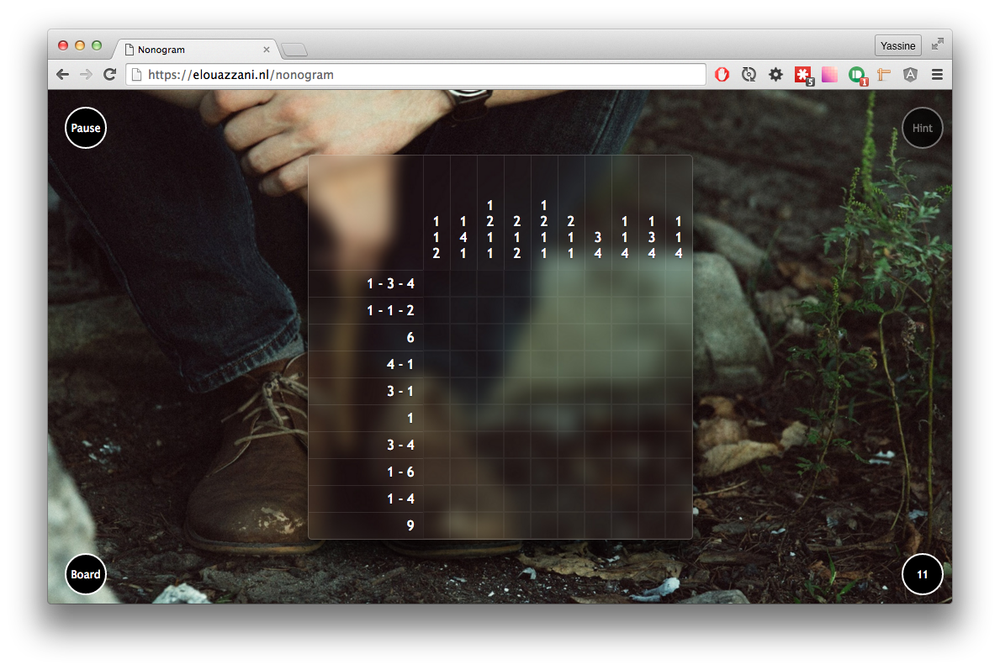

# Nonogram game

## [Online demo 🎮](https://elouazzani.nl/nonogram)

## Requirements
- npm
- node
- browserify
- Grunt

## Getting started

### Tools

Make sure you have Grunt & browserify already installed.

- Install Grunt `sudo npm install -g grunt-cli`
- Install browserify `sudo npm install -g browserify`

### Setup
- Clone this project
- `cd project_folder`
- `npm install`
- `Grunt`
- Let's Play!
